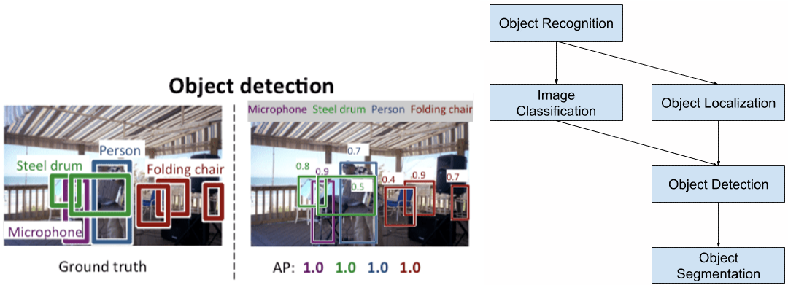
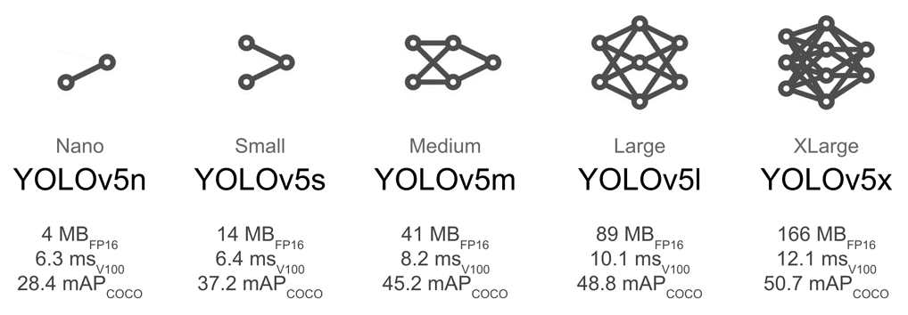

<div align="center">

Intelligent Control (ECE5759) Final Term Project: Object Detection in Aerial Image
=============================
</div>


## <div align="center">Overview</div>

<details open>
<summary>Object detection</summary>

Object detection is the task of detecting instances of objects of a certain class 
within an image. Each detected objects are usually marked with a bounding boxes 
along with a confidence score and a class ID.


<br>

Here is a demo:


</details>


<details open>
<summary>YOLOv5</summary>

YOLOv5 🚀 is a family of object detection architectures and models pretrained 
on the COCO dataset, and represents <a href="https://ultralytics.com">Ultralytics</a>
open-source research into future vision AI methods, incorporating lessons learned 
and best practices evolved over thousands of hours of research and development.



</details>


<details open>
<summary>VisDrone</summary>

- Drones, or general UAVs, equipped with cameras have been fast deployed to a 
wide range of applications, including agricultural, aerial photography, fast 
delivery, and surveillance. 
- Automatic understanding of visual data collected from these platforms become 
highly demanding, which brings computer vision to drones more and more closely. 


</details>


## <div align="center">Tasks & Goals</div>

<details open>
<summary>Tasks</summary>

- In this homework, you will learn how to use YOLO object detection models on real-world surveillance datasets.
- The model, data, training and testing pipelines have been provided.
- Your job is to perform training and testing YOLOv5 models on the given dataset. 
- You can adjust some basic parameters to make the training faster, or to obtain higher accuracy.
</details>

<details open>
<summary>Deadline:</summary>

- **First trial: 11:59 PM at May 16**
- **Second trial: 11:59 PM at May 23**
- **Final: 11:59 PM at May 30**

</details>

<details open>
<summary>Goals</summary>

- Given a limited amount of training time (2 weeks), you must obtain the highest accuracy on the given dataset.
- You must make a submission file of the test-set:
  - Run prediction scripts in the Jupyter Notebook and obtain the results (.txt file) for each image.
  - Compress everything to a single zip file and rename it to: `student_id.zip`
- **We will select the best result among three trials of each student and announce the result of each trial.**

</details>


## <div align="center">Getting Started</div>

<details open>
<summary>Prerequisite</summary>

- OS: [**Ubuntu 20.04 / 22.04**](https://ubuntu.com/download/desktop).
- Environment: 
  [**Python>=3.9.0**](https://www.python.org/) 
  and [**PyTorch>=1.11.0**](https://pytorch.org/get-started/locally/) 
  with [**anaconda**](https://www.anaconda.com/products/distribution) (Recommend).
- Editor: `Jupyter Notebook`.
</details>

To getting started, you must install [**anaconda**](https://www.anaconda.com/products/distribution) 
before hand. Then open the `terminal` and get started:

```shell
cd <to-wherever-you-want-to-store-the-project-files>

# Create a new environment named `project`
conda create --name project python=3.9

# Activate the environment (you must activate the conda environment everytime you start the terminal
conda activate project

# Install Jupyter Notebook and clone the `project` repo. 
# You only need to call this command once. If you have already install it, just skip this step
conda install git jupyter
git clone https://github.com/SKKU-AutoLab-VSW/ece5759_final_term_project
cd ece5759_final_term_project
pip install -r requirements.txt

# Finally, run Jupyter Notebook and open the `final_project.ipynb` file in your web browser:
jupyter-notebook
```

## <div align="center">Leaderboard</div>

| Student ID | mAP@50 (1st) | mAP@50 (2nd) | mAP@50 (3rd) |
|------------|:------------:|-------------:|-------------:|
| Baseline   |    0.109     |              |              |
